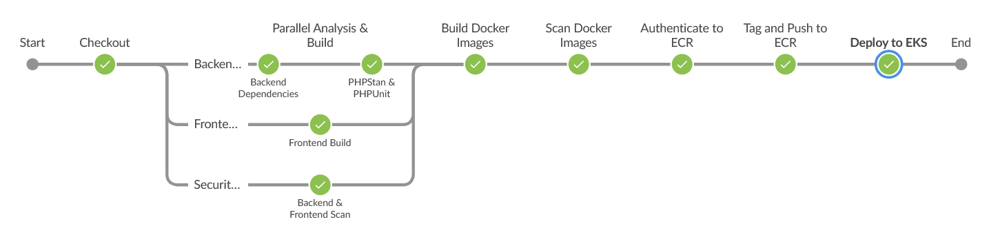
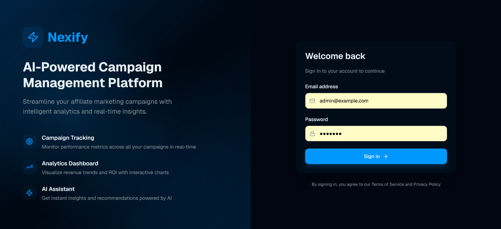

<div align="center">

# 🚀 Nexify - The Next Generation Marketing Platform

[](https://www.docker.com/)
[](https://kubernetes.io/)
[](https://nextjs.org/)
[](https://symfony.com/)
[](https://www.postgresql.org/)
[](https://www.jenkins.io/)
[](https://aws.amazon.com/)

### A modern, cloud-native platform for managing and analyzing marketing campaigns with AI-powered insights

[Features](#-features) • [Tech Stack](#️-tech-stack) • [Getting Started](#-getting-started) • [CI/CD](#-cicd-pipeline) • [Screenshots](#-screenshots)

</div>

---

## 🌟 Overview

Nexify is a production-ready, full-stack web application built for modern marketing teams. It combines the power of real-time analytics, AI-driven insights, and intuitive campaign management in a scalable, cloud-native architecture. The platform is designed with enterprise-grade DevOps practices, featuring automated CI/CD pipelines, containerization, and Kubernetes orchestration on AWS.

## ✨ Features

- 📊 **Campaign Management** - Create, update, and manage marketing campaigns with comprehensive tracking
- 📈 **Real-time Analytics** - Monitor campaign performance with interactive charts and live data visualization
- 🤖 **AI-Powered Insights** - Get intelligent recommendations and trend analysis powered by advanced AI
- 🔐 **Secure Authentication** - JWT-based authentication with role-based access control
- 💰 **Revenue Tracking** - Track ROI, conversions, and revenue across all campaigns
- 👥 **Affiliate Management** - Monitor and manage affiliate partnerships
- 📱 **Responsive Design** - Beautiful, mobile-first UI built with modern design principles

## 🛠️ Tech Stack

The project is built with cutting-edge technologies, ensuring scalability, performance, and maintainability:

### Frontend
- **[Next.js 15](https://nextjs.org/)** - React framework with App Router for server-side rendering and optimal performance
- **[React 19](https://reactjs.org/)** - Latest React with concurrent features and improved rendering
- **[TypeScript](https://www.typescriptlang.org/)** - Type-safe development for fewer bugs and better DX
- **[Tailwind CSS](https://tailwindcss.com/)** - Utility-first CSS framework for rapid UI development
- **[shadcn/ui](https://ui.shadcn.com/)** - Beautiful, accessible component library
- **[Recharts](https://recharts.org/)** - Composable charting library for data visualization

### Backend
- **[Symfony 7.3](https://symfony.com/)** - High-performance PHP framework with modern architecture
- **[API Platform 4.2](https://api-platform.com/)** - REST and GraphQL API framework with automatic documentation
- **[Doctrine ORM 3.5](https://www.doctrine-project.org/)** - Powerful database abstraction layer
- **[PostgreSQL 16](https://www.postgresql.org/)** - Advanced open-source relational database
- **[Redis 7](https://redis.io/)** - In-memory data structure store for caching
- **[PHP 8.2](https://www.php.net/)** - Latest PHP with improved performance and features

### DevOps & Infrastructure
- **[Docker](https://www.docker.com/)** - Containerization for consistent development and deployment
- **[Kubernetes (AWS EKS)](https://aws.amazon.com/eks/)** - Container orchestration for scaling and reliability
- **[Jenkins](https://www.jenkins.io/)** - Automation server for CI/CD pipelines
- **[AWS ECR](https://aws.amazon.com/ecr/)** - Container registry for Docker images
- **[AWS CloudWatch](https://aws.amazon.com/cloudwatch/)** - Monitoring, logging, and metrics for application observability
- **[Nginx](https://www.nginx.com/)** - High-performance web server and reverse proxy
- **[Supervisor](http://supervisord.org/)** - Process control system for long-running tasks

### Quality Assurance
- **[PHPUnit](https://phpunit.de/)** - Unit testing framework for PHP
- **[PHPStan](https://phpstan.org/)** - Static analysis tool for finding bugs
- **[Trivy](https://trivy.dev/)** - Security vulnerability scanner for containers

## 🚀 Getting Started

To get the project up and running on your local machine, follow these steps.

### Prerequisites

- [Docker](https://www.docker.com/get-started)
- [Docker Compose](https://docs.docker.com/compose/install/)

### Installation & Setup

1.  **Clone the repository:**
    ```bash
    git clone https://github.com/ouchajaaamine/Nexify.git
    cd Nexify
    ```

2.  **Set up environment variables:**
    
    Create a `.env` file in the root directory (optional, for AI chatbot feature):
    ```env
    GOOGLE_API_KEY=your_google_api_key_here
    ```
    
    > **Note**: The AI chatbot feature requires a Google API key. You can obtain one from the [Google AI Studio](https://aistudio.google.com/). If you don't set this key, the application will still work, but the AI assistant feature will be disabled.

3.  **Build and run the containers:**
    ```bash
    docker-compose up -d --build
    ```

4.  **Install backend dependencies:**
    ```bash
    docker-compose exec app composer install
    ```

5.  **Run database migrations:**
    ```bash
    docker-compose exec app php bin/console doctrine:migrations:migrate
    ```

6.  **Load sample data (optional):**
    ```bash
    docker-compose exec app php bin/console doctrine:fixtures:load
    ```

Once the setup is complete, the application will be available at:
- **Frontend**: [http://localhost:3000](http://localhost:3000)
- **Backend API**: [http://localhost:8000](http://localhost:8000)
- **API Documentation**: [http://localhost:8000/api](http://localhost:8000/api)

### 🐳 Docker Services

The application runs the following services:

- **frontend** - Next.js application (Port 3000)
- **app** - Symfony API with Nginx & PHP-FPM (Port 8000)
- **postgres** - PostgreSQL 16 database (Port 5432)
- **redis** - Redis cache server (Port 6379)

## 🔄 CI/CD Pipeline

I've implemented a fully automated CI/CD pipeline using Jenkins that ensures code quality, security, and zero-downtime deployments to our Kubernetes cluster on AWS EKS.



### Pipeline Stages

The pipeline consists of the following automated stages:

#### 1️⃣ **Checkout**
- Pulls the latest code from the GitHub repository
- Ensures a clean workspace for each build

#### 2️⃣ **Parallel Analysis & Build**
This stage runs multiple processes in parallel to optimize build time:

**Backend Pipeline:**
- 📦 Installs Composer dependencies
- 🔍 Runs PHPStan static analysis to catch potential bugs
- ✅ Executes PHPUnit tests to ensure code quality

**Frontend Pipeline:**
- 📦 Installs npm dependencies
- 🏗️ Builds the Next.js application for production
- ⚡ Optimizes assets and generates static pages

**Security Scan:**
- 🛡️ Scans both backend and frontend code for security vulnerabilities
- 📋 Generates security reports

#### 3️⃣ **Build Docker Images**
- Creates optimized Docker images for both frontend and backend
- Uses multi-stage builds to minimize image size
- Tags images with build numbers for traceability

#### 4️⃣ **Scan Docker Images**
- Runs Trivy security scanner on Docker images
- Checks for CVEs and vulnerabilities in dependencies
- Fails the build if critical vulnerabilities are found

#### 5️⃣ **Authenticate & Push to ECR**
- Authenticates with Amazon Elastic Container Registry
- Pushes Docker images to ECR with proper tagging
- Maintains image versioning for rollback capability

#### 6️⃣ **Deploy to EKS**
- Updates Kubernetes manifests with new image tags
- Applies configurations to AWS EKS cluster
- Performs rolling updates for zero-downtime deployment
- Monitors deployment health and rollback if needed

## 📸 Screenshots

Here's a sneak peek of the Nexify application.

### Login Page


### Dashboard


The main dashboard provides a comprehensive view of your campaigns performance with key metrics including total revenue, active campaigns, affiliate count, conversions, and conversion rates. Interactive charts display revenue trends and performance data over time, helping you monitor campaign effectiveness and identify opportunities for optimization.

---

### 📋 Campaign Management


View campaign performance metrics directly from the dashboard. Track budget allocation, revenue generation, and ROI percentages for each campaign. Filter campaigns by date range and search by campaign name to focus on specific performance data.

---

### 🤖 AI Assistant


Ask questions about your campaigns in natural language and receive AI-powered responses. The assistant analyzes your campaign data and provides insights, recommendations, and answers to specific queries about performance and optimization.

---

### 🎯 Campaign Details


Access detailed campaign analytics including budget usage, revenue generation, ROI percentages, and associated affiliates. Each campaign's data is aggregated and visualized to provide clear insights into performance metrics.

---

### 👥 Affiliate Overview


Track affiliate partnerships and their campaign associations. View affiliate information and monitor overall affiliate engagement across your campaigns.

---

## 📁 Project Structure

```
Nexify/
├── backend/                 # Symfony API application
│   ├── src/
│   │   ├── Entity/         # Doctrine entities (Campaign, Affiliate, etc.)
│   │   ├── Repository/     # Database repositories
│   │   ├── ApiResource/    # API Platform resources
│   │   ├── State/          # State processors and providers
│   │   └── Service/        # Business logic services
│   ├── config/             # Symfony configuration
│   ├── migrations/         # Database migrations
│   ├── tests/              # PHPUnit tests
│   └── composer.json       # PHP dependencies
│
├── frontend/               # Next.js application
│   ├── app/
│   │   ├── dashboard/      # Dashboard pages
│   │   ├── login/          # Authentication pages
│   │   └── layout.tsx      # Root layout
│   ├── components/         # Reusable React components
│   │   ├── ai/             # AI chat components
│   │   ├── campaign-card.tsx
│   │   └── revenue-chart.tsx
│   ├── hooks/              # Custom React hooks
│   ├── lib/                # Utilities and API client
│   └── package.json        # Node dependencies
│
├── k8s/                    # Kubernetes manifests
│   ├── 00-namespace.yaml
│   ├── 03-postgres.yaml
│   ├── 04-redis.yaml
│   ├── 05-backend.yaml
│   └── 06-frontend.yaml
│
├── jenkins/                # Jenkins configuration
├── docker-compose.yml      # Local development orchestration
└── Jenkinsfile            # CI/CD pipeline definition
```

## 🏗️ Architecture Highlights

- **Microservices Architecture**: Separate frontend and backend services that can scale independently
- **API-First Design**: RESTful API with automatic OpenAPI documentation
- **Event-Driven Updates**: Real-time data synchronization using WebSocket connections
- **Caching Layer**: Redis integration for improved performance
- **Database Migrations**: Version-controlled database schema with Doctrine migrations
- **Container Orchestration**: Kubernetes for high availability and auto-scaling
- **Infrastructure as Code**: Declarative Kubernetes manifests for reproducible deployments

## 🤝 Contributing

Contributions are welcome! Feel free to open issues or submit pull requests.

## 📄 License

This project is licensed under the MIT License.

---

## 📝 Disclaimer

This project was developed as part of my learning journey, with AI tools used only to help me understand concepts, debug issues, and improve my development approach.

---

<div align="center">


</div>